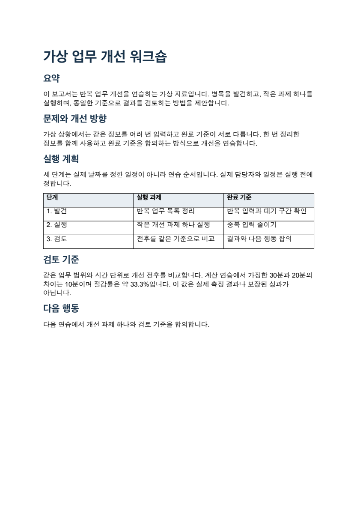

# Office Maker

기획자·강사·실무자를 위한 Codex 스킬입니다. **자료 하나로 편집 가능한 PPT·엑셀·워드를 만들고**, 필요한 형식만 따로 만들 수도 있습니다.

| PPT · 발표 흐름 | 엑셀 · 실행과 계산 | 워드 · 상세 보고서 |
| --- | --- | --- |
|  |  |  |

위 이미지는 함께 제공하는 [가상 예제](examples/synthetic/input.json)를 실제 생성한 뒤 렌더링한 화면입니다. 특정 개인·기관의 자료를 포함하지 않습니다.

| 하고 싶은 일 | Codex에서 선택할 스킬 | 결과 |
| --- | --- | --- |
| PPT 만들기 | `$ppt-maker` | 편집 가능한 `.pptx` |
| 엑셀 만들기 | `$excel-maker` | 표·수식이 있는 `.xlsx` |
| 보고서 만들기 | `$word-maker` | 선택한 양식에 맞춘 `.docx` |
| 세 가지 한 번에 만들기 | `$osmu-maker` | 같은 자료로 만든 위 세 파일 |

## 설치하고 첫 파일 만들기

플러그인을 지원하는 Codex와 Node.js 20 이상·npm이 필요합니다. 터미널에서 두 줄을 실행합니다.

```sh
codex plugin marketplace add https://github.com/jkwon-startup/office-maker --ref v0.1.1
codex plugin add office-maker@office-maker-local
```

새 Codex 대화에서 스킬 선택 목록의 **한 번에 만들기**를 선택하고 다음을 입력하세요. 호스트가 이름 공간을 표시하면 선택 목록에 보이는 이름을 사용합니다.

```text
$osmu-maker
함께 제공하는 가상 업무 개선 워크숍 예제로 PPT·엑셀·워드를 만들어줘.
예제에 들어 있는 제작안과 기본 템플릿을 사용하고 웹 조사는 하지 마.
결과는 현재 작업 프로젝트의 outputs/office-demo에,
체크포인트는 work/office-demo에 저장해줘. 필요한 실행 환경도 준비해줘.
```

스킬이 실제 설치 위치와 의존성을 확인하고 허용된 실행 환경에서 준비합니다. 캐시 경로를 직접 찾을 필요는 없습니다. 처음에는 의존성 다운로드에 네트워크와 쓰기 권한이 필요할 수 있습니다. 준비된 런타임은 다음 실행에서 재사용합니다.

완료되면 결과 폴더에 `ppt.pptx`, `excel.xlsx`, `word.docx`가 생기고 대화에 파일 링크가 표시됩니다. 예제는 PPT 5장·엑셀 2시트·워드 5절로 구성됩니다. 기존 파일을 덮어쓰지 않으므로 재사용하거나 새 결과 폴더를 선택하세요. [단계별 안내와 문제 해결](docs/quickstart.md)을 참고할 수 있습니다.

## 내 자료로 쓰기

원하는 스킬을 선택하고 자료를 첨부하세요. 스킬이 목적·독자·필수 내용·템플릿·저장 위치 중 빠진 항목을 묻고 답을 받은 뒤 제작합니다. 이미 알려 준 값은 다시 묻지 않습니다. 선택 항목은 “추천값으로 진행”이라고 요청할 수 있습니다.

형식마다 중립 템플릿 하나를 제공합니다: **기본 발표(T001)**, **기본 실행표(E001)**, **기본 보고서(W001)**. 이름 또는 고정 번호 `1`로 선택하세요. 워드 기본 보고서는 요약→문제와 개선 방향→실행 계획→검토 기준→다음 행동 순서입니다. 다른 목적의 목차를 원하면 추천 구성이나 자신의 양식을 사용하세요.

자신의 양식을 여러 개 등록하고 이름·번호로 선택하거나, `$my-ppt` 같은 호출 이름을 만들 수 있습니다. [추가 설정](docs/quickstart.md#다음에-해볼-것)에서 확인하세요. 사용자 원본·개인 템플릿·별칭은 공개 저장소 밖에서 관리합니다.

## 지원 범위와 확인 상태

- PPT: 표지·본문·비교·로드맵·KPI·마무리, 편집 가능한 텍스트·도형, 발표자 노트와 출처.
- 엑셀: 여러 시트, 열 폭·숫자 형식·필터·고정 행, 명시적 수식과 검증된 캐시 값.
- 워드: 양식의 필수 절·순서·표 머리글 대응, 실제 제목 스타일·문단·글머리표·표, 용지와 기본 서식.
- OSMU: 공통 자료와 형식별 제작안, 형식별 실패 기록, 동일 입력의 체크포인트 재개.

생성 스크립트는 제작안을 파일로 바꿉니다. 자료 해석·질문·내용 작성은 스킬을 실행하는 AI가 담당합니다. Google 서비스나 별도 유료 API가 필요하지 않습니다. MIT 라이선스로 배포합니다.

원본 Office 파일의 마스터·복잡한 구조 재사용, 사진·차트·애니메이션 삽입, 자동 화면 검사는 현재 지원하지 않습니다. ExcelJS는 수식을 계산하지 않으므로 캐시가 없는 수식은 스프레드시트 앱에서 재계산해야 합니다.

공개 예제와 기본 프로필은 LibreOffice에서 렌더링해 확인했습니다. 자동 검사는 실제 파일 구조·핵심 로직·재개를 확인하며 모든 사용자의 화면 품질을 보장하지 않습니다. **Microsoft Office와 실제 ChatGPT 대화형 실행은 별도 검증 대상**입니다. ChatGPT에서는 스킬과 파일 실행 도구를 지원하는 환경이 필요하며, 일반 대화에서 Codex의 로컬 스크립트가 자동 실행되지는 않습니다. [예제 검토 범위](examples/synthetic/expected-results.md), [v0.1.1 변경사항](docs/release-notes-0.1.1.md)을 확인하세요.

## 피드백과 개발

오류나 제안은 [GitHub Issues](https://github.com/jkwon-startup/office-maker/issues)에 남겨 주세요. 버전·환경·재현용 가상 입력·오류 메시지를 알려 주시면 도움이 됩니다. 실제 업무 파일·개인정보·비밀키는 올리지 마세요.

설치와 첫 사용에는 개발자용 검사 명령이 필요하지 않습니다. 소스를 수정하거나 기여하려면 [개발자 안내](docs/development.md)와 [배포 점검표](docs/release-checklist.md)를 참고하세요.
